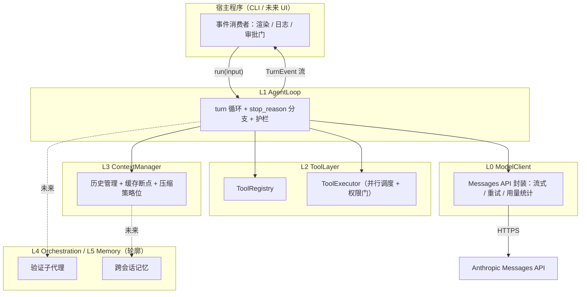
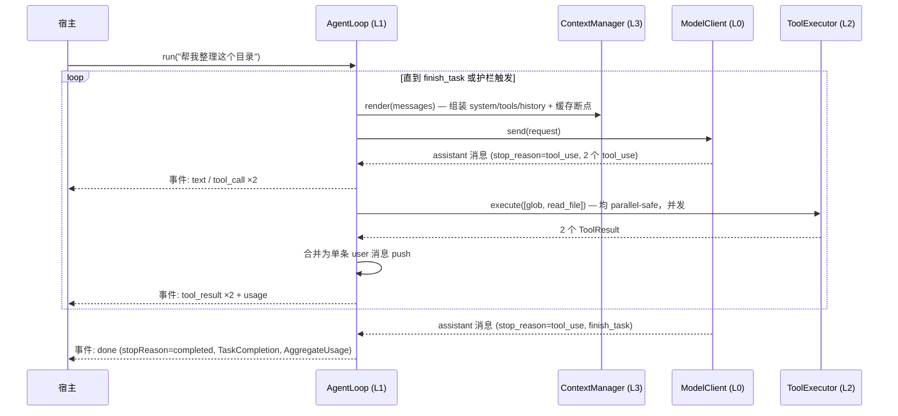

# 02 — 分层架构

## 总览

自底向上五层。v0.1 设计详细覆盖 **L0–L3**；L4/L5 只定轮廓，避免过早设计。



依赖方向：L1 是编排中心，调用 L0/L2/L3；L0/L2/L3 彼此不依赖。宿主只与 L1 的事件流交互。

---

## L0 — ModelClient

**职责**：把模型 API 收敛为一个稳定的内部接口，上层不直接接触 SDK 的请求构造细节。

两个实现（v0.6 起）：**AnthropicModelClient**（Anthropic 官方及一切 Anthropic 兼容端点——DeepSeek/GLM/Kimi/Ollama）与 **OpenAIModelClient**（一切 chat-completions 端点）。后者是 P1 的终极检验：整个 wire 协议被替换，L1/L2/L3 零改动——harness 内部统一使用 Anthropic 形状（`ModelRequest`/`ModelTurn`），OpenAI 客户端在边界做双向翻译（tool_result 块 ↔ role:"tool" 消息、tool_use ↔ tool_calls、`is_error` 降级为内容前缀、finish_reason 映射）。选择由 `AGENT_PROVIDER` 环境变量驱动（`src/provider.ts` 工厂）。

| 关注点 | 设计决策 |
|---|---|
| 请求方式 | 一律流式（`client.messages.stream`），`max_tokens` 默认 64000——非流式在大输出下会撞 SDK HTTP 超时 |
| 模型参数 | 默认 `claude-opus-4-8`；`thinking: {type: "adaptive"}` 显式设置（Opus 4.8 省略该字段=不思考）；`output_config.effort` 由 AgentConfig 透传，默认 `high` |
| 禁用参数 | 不暴露 `temperature` / `top_p` / `top_k` / `budget_tokens`——Opus 4.7+ 全部返回 400 |
| 缓存断点 | ModelClient 负责在请求组装时落 `cache_control` 标记（位置由 L3 决定，L0 只执行） |
| 重试 | 依赖 SDK 内置重试（429/5xx 指数退避）；仅补充"重试耗尽后向 loop 报告可分类错误"的语义 |
| 用量统计 | 每次响应提取 `usage`（`input_tokens` / `cache_creation_input_tokens` / `cache_read_input_tokens` / `output_tokens`），累加进本轮 run 的 AggregateUsage |
| 类型 | 全部复用 SDK 类型（`Anthropic.MessageParam`、`Anthropic.Message` 等），不自造 |

**对上契约**：`send(request: ModelRequest): Promise<ModelTurn>`，其中 `ModelTurn` = 完整 assistant 消息 + 归一化 stop_reason + usage。流式 delta 以事件形式旁路发给 loop（供 UI 实时渲染），但 loop 的控制流只依赖最终消息。

---

## L1 — AgentLoop

**职责**：核心 while 循环与全部控制流决策。这是 harness 的心脏。

### 循环结构

```
初始化 messages = [user 输入]
while true:
    检查护栏（轮数 / token 预算）→ 超限则以对应 stopReason 结束
    turn = ModelClient.send(context.render(messages))
    messages.push(turn 的完整 assistant content)      // 必须完整 push，不能只留文本
    switch turn.stop_reason:
      end_turn     → 若启用完成门：提醒继续/提问/调用 finish_task；否则按旧语义 completed
      tool_use     → 提取全部 tool_use 块 → ToolExecutor 执行 →
                     所有 tool_result 合并进【同一条】user 消息 push → continue
      pause_turn   → 直接 continue（原样重发，不追加任何用户文本）
      max_tokens   → 保留已有输出；启用完成门时只追加一轮短结构化收口
      refusal      → 结束，stopReason = refusal（不重试同一 prompt）
```

### 关键决策

- **并行工具调用**：一条 assistant 消息可含多个 `tool_use`。parallel-safe 的工具并发执行，非 parallel-safe 的串行；但无论怎么执行，**全部 `tool_result` 必须合并进单条 user 消息**——拆成多条会让模型逐渐不再发并行调用。
- **工具失败不中断**：执行异常 → 捕获 → `{is_error: true, content: 给模型看的错误说明}`；每个 `tool_use_id` 必须有对应 `tool_result`，缺一个 API 直接拒绝下一次请求。
- **护栏**：`maxTurns`（默认 50）约束单执行段；`AGENT_TOTAL_MAX_TURNS` 与 `AGENT_TOTAL_TOKEN_BUDGET` 绑定共享 `runBudget`，continuation、返工和瞬时续跑不会重置总账。轮次在发送前原子预占；token 按完整响应结算，显式 token 上限会串行化同一总账下的模型调用，允许最后一次响应自然越界，但不会因并发轨同时读取旧余额而放大超支。触发时以明确的 stopReason 结束而非抛异常。
- **结构化完成门**：真实 CLI/Web 宿主默认注册 `finish_task`。`end_turn` 是 wire 事实，不是业务完成；合法工具入参保真返回 `completed / partial / blocked`。重复观察触发换策略，仍停滞则有界强制收口。
- **事件流**：`run()` 返回 `AsyncIterable<TurnEvent>`。审批门（permission = "ask" 的工具）实现为一种需要宿主应答的事件——loop 挂起等待宿主回 allow/deny，这样 UI 形态（CLI 提示、GUI 弹窗）完全是宿主的事。

### 一轮完整 turn 的时序



---

## L2 — ToolLayer

**职责**：工具的定义、注册、权限评估与执行调度。

| 组件 | 职责 |
|---|---|
| `Tool` 接口 | name / description / inputSchema / permission / parallelSafe / execute。description 必须写清**何时调用**（"当需要 X 时调用"），不只是"做什么"——这直接影响模型的触发率 |
| `ToolRegistry` | 注册与查找；负责把 Tool 列表**确定性序列化**为 API 的 `tools` 参数（按 name 排序——工具顺序变化即缓存全灭） |
| `ToolExecutor` | 接收一批 tool_use 块 → 逐个评估权限（auto 直接执行；ask 发审批事件等宿主应答；deny 回拒绝 result）→ 按 parallelSafe 分组调度 → 统一收集 ToolResult |

**v0.2 内置工具**（最小集）：`bash`、`read_file`、`write_file`。`bash` 不再自行
调用 `child_process`：逐 run 的 `ExecutionBroker` 经
`AgentConfig → AgentLoop → ToolExecutor → ToolContext` 传播。`off/report` 是明确标注的
宿主兼容通道，`required` 只允许通过功能探测的 OCI profile，失败绝不回退宿主；当前
只覆盖 bash，故状态最多为 `partial`，不能称整个 run 已 sandboxed。required 每个
segment/命令都强制刷新；segment 收尾立即销毁 broker，follow-up 新建并重新探针。
清理未确认会撤销 coverage，per-run canary 前后双闸门阻止全局新准入。命令经 stdin
全量落入私有 tmpfs 后以 fd0=EOF 执行，不出现在 runtime argv。详细决策与后续
MCP/gateway Gate 见 `docs/adr/ADR-001-execution-isolation.md`。遵循 P2：其余能力先走
bash，出现 gate/校验/渲染/并行需求时再晋升。

**MCP 接入**（v0.7，`src/mcp.ts`）：任意 MCP server 的工具经 `adaptMcpTool` 适配为标准 `Tool`（名字加 `${server}__` 前缀），由 `mcp.json` 声明（command/args/env + per-server permission/toolPermissions/parallelSafe/includeTools）。默认 "ask" + 串行——外部进程能力面未知，宿主审批兜底（P6）；`toolPermissions` 按原始工具名细分 auto/ask，`includeTools` 白名单控制工具面大小。DomainPack 可在 server 策略上再做同构覆盖，CLI/Web 均经 `selectPackTools` 解析最终权限。isError 直接映射（P5）。首个落地：stm32-gdb-mcp 驱动 STM32L151 真机调试。

**安全基线**：`write_file` / `bash` 默认 `permission: "ask"`；路径类输入先做 lexical containment，再校验真实路径或最近存在父目录（拒绝 `..`、symlink/junction/reparse point 逃逸）。`fetch_url` 只连接已解析并固定的公网 HTTPS 地址，每次重定向重新校验 URL/DNS/IP，拒绝私网与本机目标。OCI workdir 额外拒绝 symlink 路径组件、nested mount、IPC/device 和 hardlink，并做 Docker daemon 双向 canary。ADR-002 用 daemon-resident schema-3 lease、boot-id/PID-namespace/PID starttime 存活证明和 full-ID readback，在下一次成功 probe 回收已到期且 owner 已死亡的 orphan；无后续 probe 时仍不是 autonomous TTL。Node 文件 API 与内嵌 CLI adapter 尚不能消除检查到 I/O/mount 之间的极窄 TOCTOU；独立 timer/Broker、MCP gateway、逐 run worktree/UID lease 与磁盘/inode 配额仍未完成，所以 SAFE-05 保持部分完成。

---

## L3 — ContextManager

**职责**：模型每次看到什么。持有 system prompt 与消息历史的组装策略。

| 关注点 | 设计决策 |
|---|---|
| system prompt | 构造时冻结（P3）；动态上下文（当前时间、环境信息）以文本块追加在 messages 中，永不改 system |
| 缓存断点 | 两个：① system 最后一个 text 块（缓存 tools+system）；② 最近一条 user 消息的最后一个 content 块（会话增量缓存）。注意 20 块回溯窗口：单轮工具块过多时在中段补打断点 |
| 缓存最小长度 | Opus 4.8 最小可缓存前缀为 4096 token——system+tools 太短时打了标记也不缓存，属正常现象，文档化即可 |
| 窗口逼近策略 | v0.3 + **MEM-01**：水位 80% 时把保护窗口外大体积 `tool_result` 置换为**语义占位**（保留该次交换的失败/证据/副作用摘要），并 upsert `[compact_ledger]` 文本块（用户约束、决策、失败尝试、证据引用、side-effect 账本）。结构不破坏、操作幂等；loop **替换正史**保缓存前缀稳定。仍非 LLM 摘要；server-side compaction（beta）仍属更远 |
| 跨重启恢复 | 每个完整 main 段导出最后输入水位；恢复后的 `AgentLoop` 用该水位在首个请求前决定是否 compact，避免把大历史盲发一次后才发现超窗 |
| Token 核算 | 汇总口径 = `input + cache_creation + cache_read`（`input_tokens` 只是未缓存部分）；对外报表必须区分三者，否则"缓存是否生效"无法判断 |

---

## L4 — Orchestration（v0.4 已落地首个用例）

- **Verifier subagent**（`src/verifier.ts`）：子代理 = 复用父级 systemPrompt/tools 的全新 AgentLoop（请求前缀一致，蹭 tools/system 层缓存），但看不到主 agent 的会话历史——只拿到任务描述 + 执行者报告，必须亲自用工具核查实际产出（fresh-context 验证优于自我批评）。只读纪律是硬约束（P6）：verifier 内部对一切 approval_request 自动 deny 并回传理由，写类工具在其中永远执行不了。裁决为 JSON（`{passed, issues, summary}`），宽容解析、解析失败视为不通过（fail-closed）。
- **编排器**（`src/orchestrate.ts`）：`runVerified()` = 主 run → 核查 → 未通过则把问题清单拼进返工输入再跑一轮（`maxReworks` 可配，默认 1）。宿主经 `onEvent(source, event)` 观察全过程，审批仍归宿主。
- **评估基线**（`eval/`）：5 个固定用例 + 程序化判定，`npm run eval` 生成 `eval/baseline-report.md`（成功率/轮数/token 成本），作为 harness 改动的回归基准。

## Web Host — 持久化检查点与运行谱系

Web 宿主把 `meta.json`、`events.jsonl`、`transcript.jsonl` 分开落盘。父归档是不可变的
审计记录；跨重启续跑不会尝试序列化/复活 `AgentLoop` 活对象，而是从最近完整 main
段派生子 run。检查点只包含可验证恢复所需的最小状态：transcript 段号、对话轮数、
Context 输入水位、共享 `runBudget` 快照，以及完整 main 段结束时仍有效的版本化审批
grant **审计快照**。该快照用于回答“当时有哪些授权”，不是可执行 capability。

派生边界是 fail-closed 的：只支持无独立核查的 single run；工作目录必须仍命中当前
宿主白名单，领域包必须仍存在；旧检查点上限与当前宿主上限逐项取更严格值，已用轮次
和 token 不清零。子 run 使用当前模型/工具/策略，审批放行、挂起交互与 `ask_user`
已用配额全部重置；父 grant 因 `runId` 不同绝不继承，并逐条写入 durable
`approval_grant_not_inherited`。`run_forked` 同时记录直接父级、根运行和环境边界。

## L5 — Memory（v0.5 已实现）

文件式跨会话记忆（`src/memory.ts`）。三个关键设计决策：

| 决策 | 理由 |
|---|---|
| **索引不落盘**：`memory_list` / `indexBlock()` 实时从每个文件首行提取摘要 | 不依赖模型自觉维护 MEMORY.md（P6：不变量靠 harness，不靠 prompt 纪律）——索引永不漂移 |
| **专用工具 + auto 权限**：`memory_write` 写盘却不需要审批 | P2 晋升的正面案例：写操作被硬性圈禁在 memoryDir 内（名字正则 + 路径校验 + 64KB 上限），圈禁不变量使 auto 成立；通用 write_file 依然 ask |
| **索引经 dynamicContext 注入** | 模型开局即知自己记得什么（否则记忆等于不存在）；易变信息进 messages 不进 system（P3） |

工具面：`memory_list` / `memory_read`（parallelSafe）+ `memory_write` / `memory_delete`。一条记忆 = 一个 `.md` 文件，首行即摘要；记忆是"值得复用的事实/偏好/教训"，不是数据仓库（64KB 上限强制这一点）。CLI 默认目录 `<cwd>/.agent-memory`（`AGENT_MEMORY_DIR` 覆盖）。

---

## 关键 API 事实备忘（实现时的硬约束）

以下事实来自 2026-06 版 Claude API 规范，实现 v0.2 前须再核对一次：

1. **并行 tool_result 必须合并**：一条 assistant 消息里的多个 `tool_use`，其结果必须在**单条** user 消息中全部返回；每个 `tool_use_id` 缺一不可。
2. **`pause_turn`**：服务端工具循环达到迭代上限时出现；处理 = 把 assistant 回复 append 后原样重发，**不要**追加 "Continue" 之类的用户文本。
3. **Prompt caching 前缀规则**：渲染顺序 tools → system → messages；前缀任何字节变化使其后缓存失效；缓存按模型隔离；最多 4 个断点；断点向前回溯至多 20 个 content 块。
4. **Opus 4.8 / Fable 5 家族参数约束**：`budget_tokens`、`temperature`/`top_p`/`top_k`、末尾 assistant prefill 均返回 400；thinking 用 `{type: "adaptive"}`（Opus 4.8 需显式设置；`display` 默认 `"omitted"`，需要展示思考摘要时设 `"summarized"`）。
5. **大输出必须流式**：`max_tokens > ~16K` 的非流式请求会撞 SDK HTTP 超时；流式上限 128K。
6. **工具输入永远 `JSON.parse` 后使用**：模型产生的 `input` 可能有不同的转义风格，禁止对序列化字符串做原文匹配。
7. **`refusal` 停止原因**：HTTP 200 + `stop_reason: "refusal"`；读 content 前先查 stop_reason，且不要用同一 prompt 重试。
