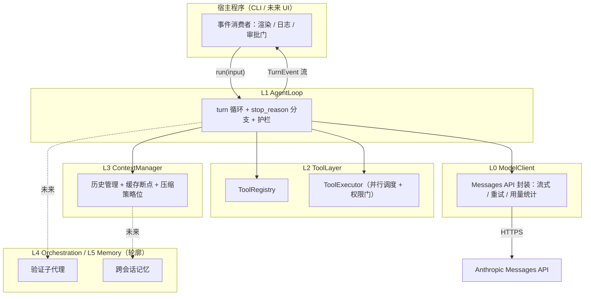
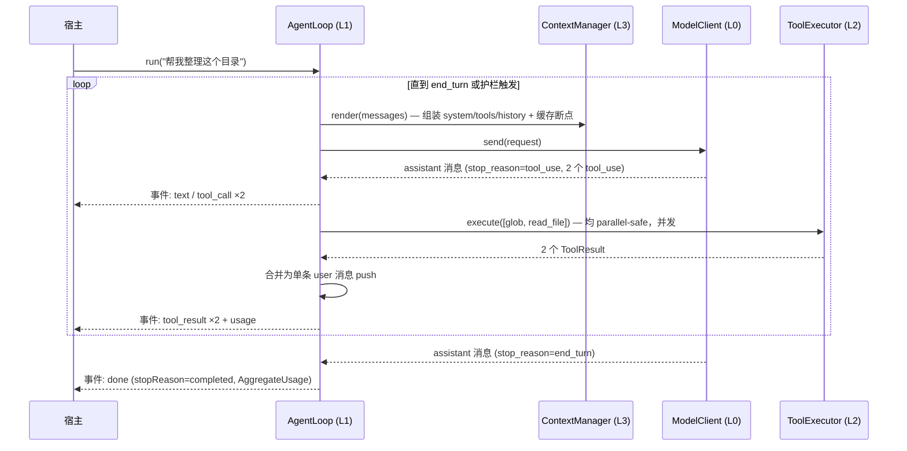

# 02 — 分层架构

## 总览

自底向上五层。v0.1 设计详细覆盖 **L0–L3**；L4/L5 只定轮廓，避免过早设计。



依赖方向：L1 是编排中心，调用 L0/L2/L3；L0/L2/L3 彼此不依赖。宿主只与 L1 的事件流交互。

---

## L0 — ModelClient

**职责**：把 Messages API 收敛为一个稳定的内部接口，上层不直接接触 SDK 的请求构造细节。

| 关注点 | 设计决策 |
|---|---|
| 请求方式 | 一律流式（`client.messages.stream`），`max_tokens` 默认 64000——非流式在大输出下会撞 SDK HTTP 超时 |
| 模型参数 | 默认 `claude-opus-4-8`；`thinking: {type: "adaptive"}` 显式设置（Opus 4.8 省略该字段=不思考）；`output_config.effort` 由 AgentConfig 透传，默认 `high` |
| 禁用参数 | 不暴露 `temperature` / `top_p` / `top_k` / `budget_tokens`——Opus 4.7+ 全部返回 400 |
| 缓存断点 | ModelClient 负责在请求组装时落 `cache_control` 标记（位置由 L3 决定，L0 只执行） |
| 重试 | 依赖 SDK 内置重试（429/5xx 指数退避）；仅补充"重试耗尽后向 loop 报告可分类错误"的语义 |
| 用量统计 | 每次响应提取 `usage`（`input_tokens` / `cache_creation_input_tokens` / `cache_read_input_tokens` / `output_tokens`），累加进本轮 run 的 AggregateUsage |
| 类型 | 全部复用 SDK 类型（`Anthropic.MessageParam`、`Anthropic.Message` 等），不自造 |

**对上契约**：`send(request: ModelRequest): Promise<ModelTurn>`，其中 `ModelTurn` = 完整 assistant 消息 + 归一化 stop_reason + usage。流式 delta 以事件形式旁路发给 loop（供 UI 实时渲染），但 loop 的控制流只依赖最终消息。

---

## L1 — AgentLoop

**职责**：核心 while 循环与全部控制流决策。这是 harness 的心脏。

### 循环结构

```
初始化 messages = [user 输入]
while true:
    检查护栏（轮数 / token 预算）→ 超限则以对应 stopReason 结束
    turn = ModelClient.send(context.render(messages))
    messages.push(turn 的完整 assistant content)      // 必须完整 push，不能只留文本
    switch turn.stop_reason:
      end_turn     → 结束，stopReason = completed
      tool_use     → 提取全部 tool_use 块 → ToolExecutor 执行 →
                     所有 tool_result 合并进【同一条】user 消息 push → continue
      pause_turn   → 直接 continue（原样重发，不追加任何用户文本）
      max_tokens   → 输出被截断：报事件，按策略重试一次（提高 max_tokens）或结束
      refusal      → 结束，stopReason = refusal（不重试同一 prompt）
```

### 关键决策

- **并行工具调用**：一条 assistant 消息可含多个 `tool_use`。parallel-safe 的工具并发执行，非 parallel-safe 的串行；但无论怎么执行，**全部 `tool_result` 必须合并进单条 user 消息**——拆成多条会让模型逐渐不再发并行调用。
- **工具失败不中断**：执行异常 → 捕获 → `{is_error: true, content: 给模型看的错误说明}`；每个 `tool_use_id` 必须有对应 `tool_result`，缺一个 API 直接拒绝下一次请求。
- **护栏**：`maxTurns`（默认 50）与 `maxTokensBudget`（可选）由 loop 每轮检查强制执行；触发时以明确的 stopReason 结束而非抛异常。
- **事件流**：`run()` 返回 `AsyncIterable<TurnEvent>`。审批门（permission = "ask" 的工具）实现为一种需要宿主应答的事件——loop 挂起等待宿主回 allow/deny，这样 UI 形态（CLI 提示、GUI 弹窗）完全是宿主的事。

### 一轮完整 turn 的时序



---

## L2 — ToolLayer

**职责**：工具的定义、注册、权限评估与执行调度。

| 组件 | 职责 |
|---|---|
| `Tool` 接口 | name / description / inputSchema / permission / parallelSafe / execute。description 必须写清**何时调用**（"当需要 X 时调用"），不只是"做什么"——这直接影响模型的触发率 |
| `ToolRegistry` | 注册与查找；负责把 Tool 列表**确定性序列化**为 API 的 `tools` 参数（按 name 排序——工具顺序变化即缓存全灭） |
| `ToolExecutor` | 接收一批 tool_use 块 → 逐个评估权限（auto 直接执行；ask 发审批事件等宿主应答；deny 回拒绝 result）→ 按 parallelSafe 分组调度 → 统一收集 ToolResult |

**v0.2 内置工具**（最小集）：`bash`（自定义 schema 的普通工具，宿主本地执行，超时+输出截断）、`read_file`、`write_file`。遵循 P2：其余能力先走 bash，出现 gate/校验/渲染/并行需求时再晋升。

**安全基线**：`write_file` / `bash` 默认 `permission: "ask"`；路径类输入一律 resolve 到规范形式并校验在工作目录内（拒绝 `..`、符号链接逃逸）。

---

## L3 — ContextManager

**职责**：模型每次看到什么。持有 system prompt 与消息历史的组装策略。

| 关注点 | 设计决策 |
|---|---|
| system prompt | 构造时冻结（P3）；动态上下文（当前时间、环境信息）以文本块追加在 messages 中，永不改 system |
| 缓存断点 | 两个：① system 最后一个 text 块（缓存 tools+system）；② 最近一条 user 消息的最后一个 content 块（会话增量缓存）。注意 20 块回溯窗口：单轮工具块过多时在中段补打断点 |
| 缓存最小长度 | Opus 4.8 最小可缓存前缀为 4096 token——system+tools 太短时打了标记也不缓存，属正常现象，文档化即可 |
| 窗口逼近策略 | v0.3 已实现：上一轮实际输入（input+cacheW+cacheR）超过 `contextTokenLimit` 的 80% 时，把保护窗口（默认最近 6 条消息）之外的大体积 tool_result 置换为占位文本；结构不破坏、操作幂等；loop 用结果**替换正史**，保证后续前缀稳定不抖缓存。后续版本可切换到 server-side compaction（beta `compact-2026-01-12`，需完整回传 compaction 块） |
| Token 核算 | 汇总口径 = `input + cache_creation + cache_read`（`input_tokens` 只是未缓存部分）；对外报表必须区分三者，否则"缓存是否生效"无法判断 |

---

## L4 / L5 — 轮廓（不在 v0.1 详设范围）

- **L4 Orchestration**：子代理 = 用独立 ContextManager + 相同 ModelClient 起一个新 AgentLoop。首个用例是 **verifier subagent**——用干净上下文核查主 agent 的产出（fresh-context 验证优于自我批评）。子代理复用父级的 system/tools 前缀以蹭缓存。
- **L5 Memory**：文件式跨会话记忆（一个 `memory/` 目录 + 读写工具 + 索引文件）。等 v0.4 有真实使用场景后再设计细节。

---

## 关键 API 事实备忘（实现时的硬约束）

以下事实来自 2026-06 版 Claude API 规范，实现 v0.2 前须再核对一次：

1. **并行 tool_result 必须合并**：一条 assistant 消息里的多个 `tool_use`，其结果必须在**单条** user 消息中全部返回；每个 `tool_use_id` 缺一不可。
2. **`pause_turn`**：服务端工具循环达到迭代上限时出现；处理 = 把 assistant 回复 append 后原样重发，**不要**追加 "Continue" 之类的用户文本。
3. **Prompt caching 前缀规则**：渲染顺序 tools → system → messages；前缀任何字节变化使其后缓存失效；缓存按模型隔离；最多 4 个断点；断点向前回溯至多 20 个 content 块。
4. **Opus 4.8 / Fable 5 家族参数约束**：`budget_tokens`、`temperature`/`top_p`/`top_k`、末尾 assistant prefill 均返回 400；thinking 用 `{type: "adaptive"}`（Opus 4.8 需显式设置；`display` 默认 `"omitted"`，需要展示思考摘要时设 `"summarized"`）。
5. **大输出必须流式**：`max_tokens > ~16K` 的非流式请求会撞 SDK HTTP 超时；流式上限 128K。
6. **工具输入永远 `JSON.parse` 后使用**：模型产生的 `input` 可能有不同的转义风格，禁止对序列化字符串做原文匹配。
7. **`refusal` 停止原因**：HTTP 200 + `stop_reason: "refusal"`；读 content 前先查 stop_reason，且不要用同一 prompt 重试。
