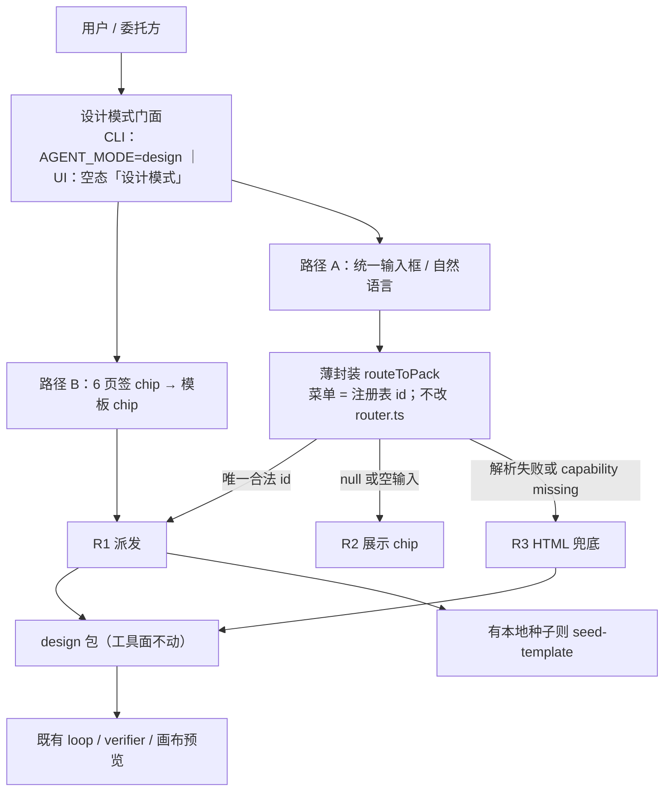

# 10 · design 模式架构演进方案（已拍板）

- 状态：已拍板 + 本轮修正；2026-09-12 Wave 1 宿主导出闭环 + Wave 2 选页续跑已接线
- 日期：2026-09-10 初稿（评审稿）；2026-09-11 拍板；2026-09-12 交付波次
- 范围：将 design 能力从「领域包之一」演进为「统一模式入口 + 模式内选择制作对象」
- 读者：委托方与实施（本文是实施依据，不再是只出方案的评审稿）
- 并列：外部对标扩展见 [11-design-mode-benchmarks-ext.md](11-design-mode-benchmarks-ext.md)

---

## 〇、本轮拍板口径（相对 2026-09-10 评审稿）

下列修正覆盖 11 号对入口的改写、注册表导出字段、R3 文案、多命中检测缺口、catalog 冻结范围、`3d-object` 出处，以及 PPTX/PDF 导出口径。未列项沿用下文原方案；与本节冲突的，以本节为准。

### 0.1 入口形态（11 号修正）

通行形态是 **统一输入框优先**，制品类型是输入框下的 **chip**（先 6 个页签，再展开该页签下的模板），不是必经的 Kimi 式侧栏清单。Kimi `/design` 侧栏只是对标样本之一，不是本仓库要复刻的入口。

- 路径 A：自然语言描述，薄封装调用现有 `routeToPack` 自动匹配。
- 路径 B：6 个页签 chip → 模板 chip。「已安装设计类文件包」仍是 Path B 的一项：列出 `allPacks()` 里已安装文件包，供点选。10 号未给出「设计域」过滤谓词，**不做描述启发式**；未点选则后端仍是 `design`。

CLI：`AGENT_MODE=design`。UI：会话空态一等入口「设计模式」。进入后锁定后端包为 `design`（现有包，工具面不扩权）。文案用 **「设计模式」**，不用 OpenDesign 当产品名（见附 B）。

### 0.2 注册表须有导出/交接字段

每条类型除 `id` / `tab` / `mode` / `title` / `description` / `pack` / `seed` 外，必须有 **`export`**（以及实施用的 `capability`）。外部产品把导出做成类型的一等属性；注册表不再只映射「类型 → 包 + 模板目录 + 描述」。

`export` 填法：`html` 全有；`pptx` / `pdf` 标在 Deck 与「agent 可写二进制」的类型上；`mp4` / `png` 等只在该条官方写过时抄上，并标 `capability: missing`。禁止用 Canva / Microsoft 等外部产品名当 UI 文案（11 号：品牌会漂）。

### 0.3 R3 不再写「PPTX 需后导出」

PPTX/PDF 是一等导出。**创作源仍是 HTML**（沙箱预览只认 HTML）。Deck 的 `.pptx` 由宿主从 `section.slide[data-slide]` 契约派生（`src/deck-pptx.ts`，pptxgenjs 写出可编辑形状）；画布「导出 PowerPoint」触发，不指望模型记得调用 `write_pptx`。`write_pptx` 仍保留，供模型手写简单标题+正文页。PDF 仍是已有文件下载 + 幻灯打印路径。不做通用 CSS 盒模型还原，也不引入 python-pptx / jsdom 生产依赖。

R3 只处理：解析失败，或命中条 `capability: missing` → fail-open 为 `design` 包 + 空白 `index.html`，summary 写明缺的能力。路由失败仍不阻塞。**不再写「PPTX 需后导出」**。核查：存在性 + 扩展名（含宿主写出的文件）；不解析 OOXML。

Kimi 设计模式的导出形态在 11 号仍标 **未核实**。本文不对齐、不补造任何未核实的 Kimi 导出格式。

### 0.4 「一条描述命中 ≥2 类型」检测未做

现有 `routeToPack` 只输出 `{ pack, reason }`，菜单是 `DomainPack[]`，**表达不了多命中**。已拍板方案不改 `src/router.ts` 解析契约，也 **不另写第二套分类器**。多制品描述若 router 给出某一个合法注册表 `id`，按 R1 走并照实可改；给 `null` 则 R2。这与 2026-09-10 原文 R2「一条描述命中 ≥2 个类型」的差距是已知缺口，不假装已实现多命中检测。

### 0.5 Catalog 冻结范围 = Open Design README 逐条表 + `3d-object`

对齐范围是 **本仓库注册表条目**，不是拷贝 [nexu-io/open-design](https://github.com/nexu-io/open-design) 的 `skills/`、`design-templates/`、`plugins/`。**不把 Open Design 源码搬进本仓库。**

v1 冻结来源 = Open Design GitHub README **逐条列出** 的 design-templates 表，加上本轮指定的 `3d-object`。`html-ppt-*` 收成一条 `html-ppt`。

README 表内 id：`web-prototype`、`saas-landing`、`dashboard`、`mobile-app`、`mobile-onboarding`、`social-carousel`、`email-marketing`、`magazine-poster`、`motion-frames`、`sprite-animation`、`pm-spec`、`team-okrs`、`eng-runbook`、`finance-report`、`hr-onboarding`、`guizang-ppt`、`html-ppt-*`、`hyperframes`、`critique`、`tweaks`。

页签分组另参考 Open Design `docs/modes.md`（New Project 六个页签：Prototype / Live Artifact / Deck / Template / Media / Other；七个 `od.mode`：`prototype` | `deck` | `template` | `design-system` | `image` | `video` | `audio`）。文档声明两套分类 **不是一一对应**。

各页对技能/插件/设计系统的总数不一致（19 / 31 / 100+ / 259+、277 plugins、151 design systems 等），GitHub 目录页是 JS 壳、未能列出全目录。**不声称已对齐 277 个插件或 151 套设计系统。** 不在本文起草那些目录的文件包。

种子：`saas-landing`→`landing-basic`、`guizang-ppt` / `html-ppt`→`deck-basic`、`social-carousel` / `magazine-poster`→`social-basic`、`pm-spec`→`pm-spec`、`team-okrs`→`team-okrs`；其余 `blank`。另有命名路径 `spec-plus-deck`（规格 + 幻灯），不是通用多命中检测。不移植 Open Design 模板文件。仓库当前没有 `.agent-packs/`（见 1.2），未点选已安装文件包时后端仍是 `design`。

### 0.6 `3d-object` 出处与能力边界

本仓库注册表补一条 `id=3d-object`（委托方指定）。公开页 **没有** 这个字符串，不能写成 Claude Design 或 Kimi 的官方类型 id。

| 出处 | 结论 |
|---|---|
| Anthropic 发布公告（Frontier design） | 六类含 **Frontier design**：code-powered prototypes with voice, video, **shaders, 3D**, or built-in AI |
| 2026-09-11 现产品页 [claude.com/product/design](https://claude.com/product/design) | 六类是 Prototypes、Wireframes and mockups、Design explorations、Pitch decks、Marketing collateral、**Documents**。**没有** `3d-object` 这个类型名，也没有 Frontier design 这一栏 |
| Claude 帮助中心 Get started 示例提示 | 同样未列 3D object |
| Claude SketchUp / Blender connector | 聊天/连接器，不是 Claude Design 的制品类型清单 |
| Kimi `/design` 侧栏（2026-09-10 抓取） | PPT / 文档 / 网站 / 表格 / 设计，**未载明** 3D 或 `3d-object` |
| Kimi K3 博客 | 模型「3D reasoning」与演示页，不是设计模式入口的制品类型 |

因此 **不能用 Kimi 补这条官方类型**。注册表 `source` 须写明「现产品页未列此 id」。职责文案只引用公告 Frontier design 的 “3D / shaders”，UI title 用「三维对象」，不写外部产品名。

| 字段 | 取值 | 依据（不扩写） |
|---|---|---|
| `id` | `3d-object` | 委托方指定的注册表 id；Claude / Kimi 公开页未出现此字符串 |
| `tab` | Prototype | 公告把 3D 放在 Frontier **prototypes** 里 |
| `mode` | `prototype` | 同上；不是 `image` / `video` / `audio` |
| `title` | 三维对象 | 11 号命名解耦 |
| `description` | 可交互的三维对象：自包含 HTML 页里的 shader / WebGL 场景 | 只取公告 “shaders, 3D” + 本仓库 HTML 沙箱能预览的形态 |
| `pack` | `design` | 后端仍是 design 包 |
| `seed` | `blank` | 本仓库没有 3D 模板 |
| `export` | `html` | 本仓库预览只认 HTML；公告/产品页未把 `.glb` / `.gltf` 写成 Claude Design 导出项 |
| `capability` | 自包含 HTML/WebGL/JS 为 `ready`；`.glb` / `.gltf` / Blender 为 `missing` | design 包允许少量 JS、禁止外链 CDN；不接 SketchUp/Blender 连接器 |

若以后官方出现名为 `3d-object` 的类型，只改注册表 `source` 注释，不改 id。

### 0.7 明确不做（拍板范围）

- 不改 `src/router.ts` 的解析契约；`--auto` / `--plan` / `AGENT_PACK=design` 与现状并存（见 5.2）。`--plan` 与模式同用时 `--plan` 优先。
- 不把 Open Design 源码、277 插件、151 设计系统搬进本仓库。
- 不做通用 HTML→PPTX（不还原 CSS 盒模型、不加 python-pptx、不把 jsdom 拉进生产）。Deck 的 `.pptx` 由契约转换器从幻灯 HTML 派生；`write_pptx` 仍供模型手写简单页。PDF 仍不另加库。
- 不为 `capability: missing` 的 Video/Audio/HyperFrames 接外部媒体供应商。
- 不对齐 Kimi 未核实的导出形态。
- 不把 `3d-object` 写成 Claude Design 或 Kimi 的官方类型 id。

---

## 一、现状梳理

### 1.1 内置领域包清单（src/presets.ts，`PACKS`，共 7 个）

| 包名 | 职责（presets.ts 描述摘要） | 工具面 / 核查要点 | 现有入口方式 |
|---|---|---|---|
| stm32-debug | STM32 真机烧录与调试：ST-Link/OpenOCD 上电、烧录 ELF、断点/变量/故障现场取证（行 511） | 内置仅 read_file/write_file，调试动作全走 MCP；programmatic 核查 | AGENT_PACK / AGENT_PRESET、--auto 路由、--plan 派包、UI 选包 |
| stm32-coding | STM32 固件编程：读写 C 源码、CMake 交叉编译、产出 ELF 交接 stm32-debug（行 575） | bash + 检索写件；programmatic 核查 | 同上四路 |
| python-coding | Python 工程：pytest/ruff/mypy 质量门禁（行 601） | bash + 检索写件 | 同上四路 |
| ts-coding | TypeScript/Node 工程：vitest/tsc 质量门禁（行 631） | bash + 检索写件 | 同上四路 |
| consult | 有据技术咨询：web_search + fetch_url 取一手资料，硬数字须引用或标未核实（行 678） | 网络检索面，无 bash | 同上四路 |
| kicad | KiCad EDA 文件工程：直写原理图/PCB s-expression + kicad-cli ERC/DRC 程序化验收（行 706） | 含 describe_image；核查 25 轮、执行 70 轮 | 同上四路 |
| design | HTML 设计台（包内路线名仍写 OpenDesign；**对外文案用「设计模式」**）：落地页/多页幻灯等真实 HTML+CSS，沙箱整站预览与点评（行 746；DESIGN_SYSTEM 在行 482） | 含 generate_image/web_search/fetch_url；rubric 核查；契约：入口 HTML、相对路径禁 CDN 字体脚本、`.slide[data-slide]`、write_file 整写、禁 git 写命令 | 同上四路，外加 UI 模板播种与画布预览（见 1.3） |

### 1.2 文件包机制（src/pack-manifest.ts + src/pack-files.ts）

| 机制 | 现状（核实结论） |
|---|---|
| 目录约定 | `<根>/drafts/<name>/{pack.json,SYSTEM.md,VERIFY.md?}` 与 `<根>/installed/<name>/...`；根 = `AGENT_PACKS_DIR` 或 `<cwd>/.agent-packs`（pack-files.ts `packsRootFromEnv`） |
| 装载规则 | 草稿不进 `getPack`；安装 = 签字：挪入 `installed/` 再 `registerFilePack`；内置同名文件包直接丢弃；菜单用 `allPacks()` = 内置 + 已安装（presets.ts 行 785/790） |
| schema | `PACK_MANIFEST_SCHEMA_VERSION = 1`，未识别版本 fail-closed（CLI exit 1 / UI 抛错） |
| 权限只收窄 | 工具白名单 `ALLOWED_FILE_PACK_TOOLS` 之外剥掉；`mcp:true` 一律当 false；maxTurns 上限 40 |
| 仓库现状 | 经 glob 复核：仓库当前**不存在** `.agent-packs/` 目录，即没有任何文件包草稿或已安装包（与规划期探测一致） |
| UI 管理面 | `/api/packs` 系列端点（列表/写草稿/安装/丢弃），ui/server.ts 行 7342-7348 |

### 1.3 现有入口 / 调用方式

| 入口 | 机制 | 出处 |
|---|---|---|
| `AGENT_PACK=design`（`AGENT_PRESET` 兼容别名） | 显式选包；未知名称启动即报错并列出可选包 | src/cli.ts 行 343-350；别名底层为 `getPreset = getPack`（presets.ts 行 838） |
| `--auto` | 调度单元 routeToPack：无工具、两轮上限的分类调用；fail-open——解析失败/未知包名 → 不选包按默认配置执行；显式选包优先于路由 | src/cli.ts 行 351-366；src/router.ts |
| `--plan` | 忽略显式选包，planner 按子任务 `pack` 字段派包；未知包子任务降级默认配置并在 UI 出告警 | src/cli.ts 行 344；src/planner.ts 行 29/489；ui/server.ts 行 6155-6162 |
| Web UI 逐 run 选包 | 进程级默认包 + 逐 run 覆盖（V-24）；follow-up 可 `autoPack` 走 routeToPack 自动匹配，失败保持原包（fail-open） | ui/server.ts 行 3877、4084-4104 |
| UI 模板播种 | 会话空态选模板，提交后宿主 `POST /api/runs/:id/seed-template` 只拷 HTML 模板进 workdir | ui/server.ts 行 7483-7487；templates/design/README.md |
| UI 画布预览 | `GET /api/runs/:id/site/...` 整站预览；多页幻灯可导出打印/PDF | ui/server.ts 行 7488；templates/design/README.md |
| 模板资产 | `templates/design/`：deck-basic（多页幻灯）、landing-basic（单页落地）、DESIGN.md.example（可选品牌契约） | templates/design/（glob 核实，共 7 个文件） |

拍板后的**推荐入口**（`AGENT_MODE=design` / UI「设计模式」）见第〇节与 5.1，不记入上表「2026-09-10 已存在」列。P4 起文档以此为准；`AGENT_PACK=design` 仍可用。

### 1.4 现状问题

1. design 与其余 6 个工程包平级排列，「做设计」没有独立模式语义：用户须先知道包名再显式选择，或赌 router 从全菜单（含固件/EDA）里命中。
2. 制品类型（落地页/幻灯/模板种子）的选择散落在 UI 空态与模板目录里，CLI 侧完全没有对应入口。
3. 入口四条路（显式/--auto/--plan/UI）各自独立，没有「进入设计模式后再决定做什么」的统一层。

---

## 二、外部对标（本次抓取的一手来源）

| 产品 | 公开形态（摘录要点） | 来源 |
|---|---|---|
| Kimi（kimi.com） | 首页为统一会话输入框（提示语「尽管问，或做个 Agent 任务...」），侧栏平铺模式/制品入口：PPT、集群、深度研究、文档、网站、表格、设计；各入口有独立路由 `/slides`、`/docs`、`/websites`、`/sheets`、`/design`、`/deep-research` | https://www.kimi.com/ （2026-09-10 抓取） |
| Kimi 设计模式 | `/design` 页标题「Kimi AI 设计 - 把你的设计工作交给 Kimi」，标语「创作天生是自由的」；`/websites` 为「快速生成可交互真实网站」，`/slides` 为「输入你想创作的 PPT 主题」。侧栏未载明 3D / `3d-object`。导出形态 **未核实** | https://www.kimi.com/design 、https://www.kimi.com/websites 、https://www.kimi.com/slides （2026-09-10 抓取） |
| Claude Design | Anthropic Labs 产品（2026-04-17 发布，research preview）：「Describe what you need and Claude builds a first version」。**公告**六类含 Frontier design（voice / video / shaders / 3D）。**2026-09-11 现产品页**六类为 Prototypes、Wireframes and mockups、Design explorations、Pitch decks、Marketing collateral、Documents——**没有** `3d-object`，也没有 Frontier design 栏。导出 Canva/PDF/PPTX/独立 HTML；可交接 Claude Code | https://www.anthropic.com/news/claude-design-anthropic-labs 、https://claude.com/product/design （2026-09-10 抓取；产品页 2026-09-11 复核） |

11 号用另外八款产品核过三条形态，**第 1、2 条按 11 号改写**（本方案只对齐形态，不逐功能复刻）：

1. 统一的「设计」模式入口成立，但「统一」不是必经侧栏：AI 原生阵营是单一输入框，设计工具阵营是独立路由/应用内模式。Kimi 式侧栏清单仅为变体，**非通行形态**。本仓库取 **统一输入框 + 输入框下 chip**。
2. 进入模式后自然语言描述为主；制品类型以 chip / 导航子路由 / FAQ 列举等 **轻量呈现** 辅助起步，不阻塞直接描述。不是必经的选择步骤。这与路径 A（默认自动路由）+ 路径 B（chip 备选）同构。
3. 产出真实可预览的页面/文件，支持迭代与导出。导出在外部产品里分三阵营（代码+托管 / 办公格式 / 设计工具交接）。本仓库拍板：HTML 走现有沙箱；**Deck 的 PowerPoint 由宿主从幻灯 HTML 派生**。不对齐未核实的 Kimi 导出形态。

说明：委托方所称「kimi opendesign」这一产品名**未核实**——Kimi 官方公开形态为「设计」模式（上表）。「OpenDesign」目前仅是本仓库 design 包内部的路线命名（DESIGN_SYSTEM 自称「OpenDesign 路线」），以及外部仓库 [nexu-io/open-design](https://github.com/nexu-io/open-design) 的项目名。文档与 UI 文案用「设计模式」，避免把 OpenDesign 写成自家产品名。

---

## 三、目标架构（门面式 Facade）

### 3.1 结构



内核不动：不改 `src/router.ts` 函数体；`--auto` / `--plan` / `AGENT_PACK=design` 行为与现在一致（5.2）。`--plan` 与模式同用时 `--plan` 优先。路由层只读注册表，新增一条类型不改路由代码。

### 3.2 各层职责与数据流

| 层 | 职责 | 改动量 |
|---|---|---|
| 设计模式门面 | 统一入口：宣告「现在是设计模式」、锁定设计域上下文（`design` 包为默认后端）、承载输入框下的页签/模板 chip | 新增薄层；CLI 一个 env + UI 一个入口 |
| 领域路由层 | 把用户自然语言映射到注册表 `id`：把每条编成只给 router 看的菜单项（`name = id`，`description = 官方职责`），调用现有 `routeToPack`；按 R1/R2/R3 动作。**不**在 router 上加置信度数值，**不**另写多命中分类器 | 新增薄封装 |
| 现有领域包（含 design 包） | 后端能力：systemPrompt、工具面、核查、护栏全部保持原样 | 零改动 |
| 模板种子（templates/design/） | 类型 → 种子目录映射，路由命中且 `seed !== blank` 后经 seed-template 拷入 workdir | 仅新增注册表，不移植外部模板文件 |
| harness 内核 | loop/verifier/planner 不感知模式存在 | 零改动 |

数据流：用户进入模式 → 输入需求或点 chip → 薄封装产出 {类型 id, 模板种子, 后端包} → 门面装配 run（`packName=design`，除非点了已安装文件包；必要时调 seed-template）→ 走现有执行/核查/画布预览链路。`run_config` / CLI 启动行照实写匹配结果（沿用现有 `packRoute` 口径）。

### 3.3 与 src/router.ts 现有调度单元的关系：复用 + 薄包裹，并存于全域路由

| 选项 | 说明 | 取舍 |
|---|---|---|
| 复用 | 模式内路由直接调 routeToPack，仅替换菜单为注册表条目（`name = id`） | 采纳 |
| 包裹 | 在 routeToPack 之外按返回值选 R1/R2/R3（唯一合法 id / null 或空输入 / 解析失败或缺能力） | 采纳（新增部分全在这一层） |
| 并存 | CLI `--auto` 的全域「任务→包」路由保持不变，与模式内「需求→制品类型」路由各管一层 | 采纳 |

理由：

1. routeToPack 的失败策略是 fail-open（router.ts 头注释：「路由是便利不是闸门」），与门面「路由错了也不该卡住创作」的要求同向，直接继承。
2. 路由菜单本就以 `allPacks()` 为参数传入（cli.ts 行 354），换菜单不需要改 router.ts 一行。
3. 两套路由层级不同不冲突：`--auto` 管「这个任务该不该选 design 包」，模式内路由管「已经在设计模式里，该用哪类模板/哪个设计域包」。模式外行为零变化。
4. 备选「改写 router.ts 支持置信度数值」被否：扩大改动面、影响 CLI/UI 两处既有调用，收益不足以抵消回归风险。多命中检测因此也做不了（0.4）。

### 3.4 注册表 v1 字段

| 字段 | 来源 | 首船填法 |
|---|---|---|
| `id` | Open Design README 表 + 本轮补条 | 0.5 那些 id；`html-ppt-*` 收成 `html-ppt`；另加 `3d-object`（0.6，不是 OD README 表内项） |
| `tab` | Open Design `modes.md` 页签 | Prototype / Live Artifact / Deck / Template / Media / Other |
| `mode` | `od.mode` 七值 | 按 README 表：多数 `prototype`，`guizang-ppt`/`html-ppt` 为 `deck`，`hyperframes` 为 `video`，`critique`/`tweaks` 为 utility（归 Other） |
| `title` / `description` | README「What it produces」原文意译 | 不自撰职责；`3d-object` 只取公告 “shaders, 3D” |
| `pack` | 本方案 | 恒为 `design`，除非用户在「已安装文件包」chip 里点了已安装包 |
| `seed` | 本仓库现有模板 | `saas-landing`→`landing-basic`、幻灯→`deck-basic`、社媒/海报→`social-basic`、`pm-spec`/`team-okrs` 各有真种子；其余 `blank` |
| `export` | 11 号字段 + 本轮导出决策 | 见 0.2、0.3 |
| `capability` | 本仓库工具面 | HTML+CSS+少量 JS + `generate_image` 标 `ready`（含自包含 WebGL/`3d-object`）；Video/Audio/HyperFrames/无供应商的媒体、以及 `.glb`/`.gltf`/Blender 原生文件标 `missing` → R3 |

---

## 四、交互设计（自动路由 + 显式选择结合）

### 4.1 两条路径

- 路径 A（默认）：进入设计模式后 **统一输入框** 里直接自然语言描述需求，薄封装自动匹配制品类型，命中即开工，并明示「已自动匹配：…，可改」。
- 路径 B（显式）：输入框下固定展示 **6 个页签 chip**，点开后再展示该页签下的模板 chip——不是必经侧栏清单。用户直接点选（UI chip / CLI 编号或 ask_user），跳过自动匹配。Prototype 页签下含「三维对象」。

### 4.2 路由判定规则（逐条可摘出）

| 规则 | 触发条件 | 动作 |
|---|---|---|
| R1 自动路由 | 需求描述经 routeToPack（注册表菜单）返回的 `pack` 是注册表里**唯一合法 `id`** | 后端仍用 `design`（除非点了已安装文件包），`seed` 按表拷贝，开工并在 run_config/启动行照实说明匹配结果与理由（沿用 `packRoute` 的「给界面照实说」口径） |
| R2 回退显式选择 | router 返回 `null`；输入为空；或用户只说「做个东西」 | 不猜测，展示 6 个页签 chip，再展开模板 chip。选定后按 R1 派发。**「一条描述命中 ≥2 类型」未实现**（0.4）：若 router 仍给出某一个合法 id，按 R1 走并照实可改。CLI R2 用编号列表一次问完（catalog 可超过 4 项）；不改 ask_user 的 4 项上限。 |
| R3 无法匹配兜底 | 路由调用失败/输出无法解析；或命中条 `capability: missing`（例如用户明确要 HyperFrames/视频而本仓库没有对应工具） | fail-open：`design` 包 + 空白 `index.html` 起步，summary 写明缺的能力。路由失败不阻塞。**不再写「PPTX 需后导出」** |

补充规则：用户在模式内任何时刻显式点名类型/模板/页签（「就用 landing-basic」）时，显式优先于一切自动判定（沿用 cli.ts「显式 > 路由」口径）；判定为跨领域任务（如「做页面并把数据脚本也写了」）按 router.ts 现口径建议转 `--plan` 交计划单元拆解。

### 4.3 判定流程

```text
进入设计模式
   │
   ├─ 用户显式点选页签/模板 chip ──────────► 按选定派发（包 + 模板种子）
   │
   └─ 用户自然语言描述
            │
            ▼
      routeToPack（注册表菜单；无多命中检测）
            │
   ┌────────┼─────────────────┐
   ▼        ▼                 ▼
 合法唯一 id  null / 空输入    调用失败或缺能力
   │        │                 │
   ▼        ▼                 ▼
 R1 派发   R2 展示 6 页签     R3 兜底：
 并照实说  chip（选定后回 R1） design 包 + 空白 HTML，
                              写明缺的能力（不写后导出）
```

### 4.4 导出口径（HTML 创作源，宿主派生 PPTX）

2026-09-10 评审稿把可编辑 PPTX 放在 R3 能力边界上，并写「PPTX 需后导出」。2026-09-11 改为 agent 写文件、宿主只下载。2026-09-12 撤销「宿主不做 Office 引擎」：

1. **创作源仍是 HTML。** 预览 / 点评 / 改稿只认幻灯 HTML。禁止再写「需后导出」充完成。
2. **Deck PPTX 由宿主派生。** `POST /api/runs/:id/export/pptx` 解析 `section.slide[data-slide]` 契约，用 pptxgenjs 写出与 HTML 同目录的 `.pptx`（可编辑文字框/表格）。画布多页幻灯始终提供「导出 PowerPoint」；没有文件先转再下。复杂版式照实记入 `lossy[]`。
3. 画布对已存在的 `.pptx` / `.pdf` 仍提供下载。`write_pptx` 保留给模型手写简单页。
4. 核查只认文件存在与扩展名，不解析 OOXML；宿主写出的文件算数。
5. Open Design 的 deck 协议写的是主产物 `index.html`、次产物 `slides.json`、「PPTX 由 agent-driven skill 导出」。本仓库改为宿主契约转换，差异记在契约注释里。
6. 明确不做：通用 CSS 盒模型还原、截图拼页当主路径、python-pptx、jsdom 生产依赖。

---

## 五、迁移路径

### 5.1 分阶段实施

| 阶段 | 范围 | 完成判据 |
|---|---|---|
| P0 方案评审 | 本文档 2026-09-10 稿 | 已完成：2026-09-11 拍板；对标引用与未核实标注见第〇节与附 B |
| P1 门面骨架 | CLI 新增 `AGENT_MODE=design`（锁定 design 包 + 模式前言；与 `AGENT_PACK` 同时出现时显式包优先）；UI 会话空态新增「设计模式」入口（输入框 + 6 页签 chip）；路由层薄封装接通 routeToPack；`run_config` 带 `mode=design` 与 `designRoute` | 旧入口回归：`AGENT_PACK=design`、`--auto`、`--plan` 行为与现状逐点一致；模式入口跑通「描述→自动匹配」与 chip 点选 |
| P2 注册表与播种 | 冻结 0.5 的注册表（含 `3d-object` 与 `export` 字段）；chip 按 `tab` 分组；命中且 `seed !== blank` 时走现有 seed-template；`blank` 不拷模板 | 注册表新增一个类型不改路由层代码；不移植 Open Design 模板文件 |
| P2-export | Deck PPTX 由宿主从幻灯 HTML 派生；`write_pptx` 仍可用 | **2026-09-12 已落地**：画布「导出 PowerPoint」始终 POST `/export/pptx`（已有同茎文件也重转）；失败进 `#ac-export-status`（alert）；回报含 `titles`；`readPptxOutline` 读回页数/文本。选页进续跑（`[改稿范围]`），未点选不钉。 |
| P3 文档 | 本文从评审稿改为已拍板 + 本轮修正；根 README 增加「设计模式」入口说明 | 文档与拍板口径一致：入口 chip 而非必经侧栏、导出字段、R3 不写后导出、多命中未做、catalog 冻结范围、不 vendor Open Design |
| P4 收敛 | 文档推荐入口改为设计模式；`AGENT_PACK=design` / `AGENT_PRESET=design` 无 `AGENT_MODE` 时 CLI 提示、不废弃 | 已落地：提示上线且旧脚本零破坏；选包下拉保留 |

### 5.2 现有直接入口的兼容与过渡策略

| 入口 | 策略 | 理由 |
|---|---|---|
| `AGENT_PACK=design` / `AGENT_PRESET` | 永久保留；无 `AGENT_MODE=design` 时 CLI 提示改用设计模式，不中断、不改包 | 归档 fork 要求包仍存在（ui/server.ts 行 3496：包不存在则只允许回看）；脚本与台账均按包名引用 |
| `--auto` 全域路由 | 不变 | 与模式内路由分层并存（见 3.3） |
| `--plan` 派包 | 不变；模式与 `--plan` 同用时 `--plan` 优先，忽略模式内路由 | 沿用 cli.ts 行 344「--plan 时忽略选包」的现有优先级 |
| UI 选包下拉 | 保留，不隐藏；「设计模式」是推荐的一等入口 | 双轨过渡，降低迁移阵痛 |

### 5.3 风险点与回退

| 风险 | 缓解 | 回退方式 |
|---|---|---|
| 路由误判导致选错模板/包 | fail-open 继承；R1 结果照实展示可即时纠正；verifier 下游兜底 | 关 env / 隐藏 UI 入口即回到现状；门面为纯新增层 |
| 双入口（模式 vs 选包）造成困惑 | UI 文案收敛为「设计模式」，选包下拉保留为高级项 | 撤文案，恢复平铺 |
| 已安装文件包进不了模式菜单 | Path B 列出 `allPacks()` 里已安装文件包；不做描述启发式过滤 | 菜单退回仅含内置 design 包 |
| 模板种子与类型清单纯硬编码、扩一个改一片 | 注册表化（含 `export`），路由层只读注册表 | 注册表退回静态清单 |
| 「OpenDesign」命名与外部产品混淆 | 文案统一用「设计模式」；Open Design 只在回源冻结清单时作为外部仓库名出现 | 随文档版本迭代 |
| 把未核实的外部 catalog 数字写成「已对齐」 | v1 只锁 README 逐条表 + `3d-object`；不声称 277 插件 | 删掉无法回源的条目 |

---

## 附 A：引用来源清单

一手页面（2026-09-10 经 bash curl 抓取；产品页与 Open Design 清单于 2026-09-11 复核）：

1. Anthropic 新闻《Introducing Claude Design by Anthropic Labs》：https://www.anthropic.com/news/claude-design-anthropic-labs
2. Claude Design 产品页：https://claude.com/product/design
3. Kimi 首页（模式入口清单）：https://www.kimi.com/
4. Kimi 设计模式：https://www.kimi.com/design
5. Kimi 建站 / PPT 子入口：https://www.kimi.com/websites 、https://www.kimi.com/slides
6. Claude 帮助中心 Get started with Claude Design：https://support.claude.com/en/articles/14604416-get-started-with-claude-design
7. Open Design README（design-templates 逐条表）与 `docs/modes.md`：https://github.com/nexu-io/open-design 、https://raw.githubusercontent.com/nexu-io/open-design/main/docs/modes.md
8. 本仓库扩展对标：[11-design-mode-benchmarks-ext.md](11-design-mode-benchmarks-ext.md)

仓库内出处（行号以 2026-09-10 工作区为准，可能漂移）：src/presets.ts（PACKS 行 509 起、design 包行 746、DESIGN_SYSTEM 行 482、allPacks 行 790）、src/pack-manifest.ts、src/pack-files.ts、src/cli.ts 行 343-370、src/router.ts、src/planner.ts、ui/server.ts（seed-template 行 7483、autoPack 行 4084）、templates/design/README.md、README.md（v0.9/v1.0 里程碑）。

## 附 B：未核实与偏差说明

1. 「kimi opendesign」作为产品名**未核实**；已核实的是 Kimi「设计」模式及其子入口（附 A-3/4/5）。文档与 UI 不用 OpenDesign 当产品名。
2. Kimi 设计模式的导出/交接形态 **未核实**（11 号原样保留）。本文不发明、不对齐任何未核实的 Kimi 导出格式。
3. 任务线索称 design 包约在 745 行：实测在 746 行（name 字段），DESIGN_SYSTEM 在 482 行，与线索一致（仅 1 行漂移）。
4. 仓库当前不存在 `.agent-packs/` 目录（glob 复核），与规划期探测一致——文件包机制已上线但尚无实例。
5. Kimi 首页另有「集群」（/agent-swarm）与「定时任务」（/tasks）入口，属 agent 编排而非制品类型，本方案不对齐。
6. Claude Design 公告含 Frontier design（3D / shaders）；2026-09-11 现产品页已用 Documents 替换该栏，且 **未列出** `3d-object`。本仓库仍按委托方指定收录该 id，并在 `source` 写明产品页未列。SketchUp/Blender connector 不是 Design 制品类型。
7. Open Design 各页的插件/设计系统总数互相打架；v1 **只锁 README 那张逐条表 + `3d-object`**，不声称已对齐 277 个插件或 151 套设计系统。
8. PPTX：宿主契约转换（`src/deck-pptx.ts` + 画布导出）为主路径；`write_pptx` 仍供模型手写简单页。PDF 仍不另加库（已有文件可下载；幻灯走打印路径）。
9. 「一条描述命中 ≥2 类型」：现有 router 做不到，本方案不另写分类器（0.4）。
